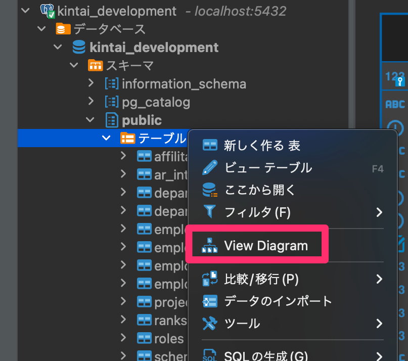

# 設計情報
## DB設計書
DB設計書はGoogleスプレッドシート上で作成しています。詳しくは下記をご覧ください。
https://docs.google.com/spreadsheets/d/16DTE2wg3ElNfrV1qs4X9JZwdrkx3qFS1tYo4NKYuVgE/edit?usp=sharing

* 留意点

  1. 階層構造は`閉包テーブルモデル`を使用しています。実装が複雑なため、必要に応じて以下の参考資料を御覧ください。

      https://docs.google.com/spreadsheets/d/1CBhZUgEMrRyd-Trv4FnO5cIrsOcu-ithNDEERFCkMUg/edit?usp=sharing

  2. 本アプリでは`閉包テーブルモデル`の実装にあたり`closure_tree`gemは使用していません。

  3. 上記のGoogleスプレッドシートのDB設計書に記載しているER図については、[DBeaver](https://formulae.brew.sh/cask/dbeaver-community)を用いて出力している。

      例:

      

# 前提条件
## 環境変数の扱い方
開発(`development`)環境では`dotenv`gemを用いて`.env`ファイルで管理することを推奨します。
`.env`ファイルのサンプルを以下に示します。

例：<プロジェクトのルートディレクトリ>/`.env`
```bash
DATABASE_NAME = kintai
DATABASE_USERNAME = kintai_user
DATABASE_PASSWORD = hoge
```

なお、本番環境(`production`)では、各々のOSに対して直接環境変数を定義するようにしてください。

## システム管理者情報
システム管理者の情報は環境変数に定義する必要があります。下記の環境変数を定義するようにしてください。

| 環境変数                       | 説明                                     |
| -------------------------- | -------------------------------------- |
| ADMINISTRATOR_MAIL_ADDRESS | システム管理者のメールアドレス。ログインや、パスワードリセット時に使用する。 |
| ADMINISTRATOR_PASSWORD     | システム管理者のログインパスワード。                     |

## DB関連
DBはPostgreSQLを前提としています。
以下の環境を準備してください。

### 環境変数
DB名、ユーザ名、パスワード、ホスト名(test環境のみ)は環境変数に定義する必要があります。下記の環境変数を定義するようにしてください。

* 本番環境(production)

| 種別       | 環境変数名        | 備考 |
| ---------- | ----------------- | ---- |
| DB名       | DATABASE_NAME     |      |
| ユーザ名   | DATABASE_USERNAME |      |
| パスワード | DATABASE_PASSWORD |      |

* 開発環境(development)

| 種別       | 環境変数名            | 備考 |
| ---------- | --------------------- | ---- |
| DB名       | DATABASE_DEV_NAME     |      |
| ユーザ名   | DATABASE_DEV_USERNAME |      |
| パスワード | DATABASE_DEV_PASSWORD |      |

* 試験環境(test)

| 種別    | 環境変数名                  | 備考                                                                |
| ----- | ---------------------- | ----------------------------------------------------------------- |
| ホスト名  | DATABASE_TEST_HOST     | 開発環境PC上ではほぼ`localhost`固定、GithubActions上ではPostgreSQLのコンテナのホスト名を指定。 |
| DB名   | DATABASE_TEST_NAME     |                                                                   |
| ユーザ名  | DATABASE_TEST_USERNAME |                                                                   |
| パスワード | DATABASE_TEST_PASSWORD |                                                                   |

### PostgreSQL環境の構築
前述の`環境変数`で定義した構成でPostgreSQL上にDB、ユーザを定義してください。

なお、ユーザにはSuperuserロールは付与せず、純粋な`CREATE ROLE`ロールのみを付与してユーザを作成してください。

例：
```sql
CREATE ROLE FOO login password 'BAR';
ALTER DATABASE HOGE_DATABASE OWNER TO FOO;
```

### 開発環境、テスト環境のマイグレーション
PostgreSQLでデータベース、ユーザを作成できたら、`bundle exec rails db:reset`でマイグレーション、及びデータ登録を実行してください。
これにより、開発とRSpecテストに必要なデータが自動的に登録されます。

なお、テストデータ登録で使用する`seeds.rb`に関しては、`RAILS_ENV`に応じて登録するテストデータを切り替えられるようにしています。

db/seeds.rb
```ruby
load(Rails.root.join("db", "seeds", "#{Rails.env.downcase}.rb"))
```

対応するテストデータ登録プログラムは以下の構成で配置してください。
```
db/seeds
└development.rb
└production.rb
└test.rb
```

### PostgreSQLの設定情報
下記資料の`PostgreSQL設定情報`シートをご覧ください。
https://docs.google.com/spreadsheets/d/16DTE2wg3ElNfrV1qs4X9JZwdrkx3qFS1tYo4NKYuVgE/edit?usp=sharing

## メール送信
### 環境変数
SMTP、システム管理者のメールアドレスは環境変数に定義する必要があります。下記の環境変数を定義するようにしてください。

| 環境変数                   | 説明                                |
| ---------------------- | --------------------------------- |
| SMTP_ADDRESS           | SMTPサーバのアドレス                      |
| SMTP_PORT              | SMTPサーバのポート番号                     |
| SMTP_DOMAIN            | SMTPサーバのHELOドメイン                  |
| SMTP_USER_NAME         | SMTPサーバのログイン用ユーザ名                 |
| SMTP_PASSWORD          | SMTPサーバのログイン用パスワード                |
| ACTION_MAILER_URL      | deviseが送信するメールの本文内のURLのFQDN名。本番用。 |
| ACTION_MAILER_DEV_URL  | 同上。開発環境用。                         |
| ACTION_MAILER_TEST_URL | 同上。テスト環境用。                        |


## CI情報
GithubActionsを使ってCIを設定しています。CIの方針は以下の通りとしています。
* PostgreSQLを使用(バージョンは、`development`環境と同様のものを使用)
* `master`,`development`ブランチへのPushをトリガーとして起動
* 使用するRubyのバージョンは、開発環境の`.ruby-version`と同じものを使用
* `bundler`,`yarn`についてはキャッシュを使用し、CIを高速化する

# Herokuについて
事前に、開発環境上で`heroku`コマンドが実行できるようにしておくこと。

## 事前導入パッケージ
以下のコマンドを実行し、RubyとNode.jsを導入すること。
```
heroku buildpacks:add --index 1 heroku/nodejs -a <AP名>
heroku buildpacks:add --index 2 heroku/ruby -a <AP名>
```

# 注意事項
## 各種バージョンアップ
Ruby、PostgreSQLをバージョンアップする場合、CIの設定ファイルも連動して変更するようにしてください。
該当箇所は下記のとおりです。
```yaml
      postgres:
        image: postgres:13
...
    container:
      # .ruby-versionで定義されているバージョンと同じものを指定すること
      image: ruby:2.7.1
...
```
